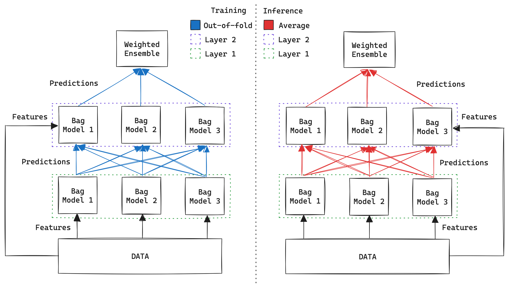

# Hackathon-Winning Solution Powered by AutoGluon

Welcome to the repository for the **winning solution** of Hi!Paris Hackathon Season 5! 🏆 This project demonstrates the power of **AutoGluon**, a state-of-the-art automated machine learning (AutoML) framework, to deliver exceptional results with minimal effort. The solution did not require hyperparameter optimization, as AutoGluon achieves remarkable performance even with its **default settings**.

---

## 🚀 Method Overview: Why AutoGluon?

### **Motivation**
Machine learning can be a complex process, requiring expertise in model selection, data preprocessing, and parameter tuning. AutoGluon simplifies this by automating the pipeline.

### **Why Use Ensemble Methods?**
Ensemble learning, the foundation of AutoGluon, combines predictions from multiple models to improve accuracy and robustness. This approach is highly effective because:
1. Different models capture different patterns in data.
2. Aggregating multiple models reduces the risk of overfitting and underfitting.
3. Ensembles often outperform individual models in real-world scenarios.

By automatically training diverse models (e.g., decision trees, gradient boosting machines, neural networks) and combining their outputs, AutoGluon delivers robust and reliable results.

### **State-of-the-Art Features of AutoGluon**
1. **Automatic Ensembling**: Combines models using bagging and stacking without requiring manual intervention.
2. **Out-of-the-Box Performance**: Delivers strong results without hyperparameter tuning, making it perfect for tight deadlines.
3. **Robust Handling of Real-World Data**: Handles missing values, categorical variables, and imbalanced datasets seamlessly.
4. **Resource-Aware**: Adjusts to available computational resources for optimal efficiency.

### **Why AutoGluon**
AutoGluon’s simplicity and effectiveness made it the perfect choice for this hackathon. We leveraged its default settings, relying entirely on its:
- Predefined ensemble methods.
- Automatic preprocessing capabilities.
- Baseline hyperparameters (no tuning required).

This approach allowed us to focus on understanding the problem and the data rather than fine-tuning the model.

---

## 📈 Results

### Key Metrics:
- **F1 Score**: 69.61%

AutoGluon, even without hyperparameter optimization, delivered superior results by:
- Automatically ensembling multiple models.
- Handling data preprocessing efficiently.
- Using robust baseline configurations designed for competitive performance.

---

## 📜 License

This project is licensed under the [MIT License](LICENSE).

---
